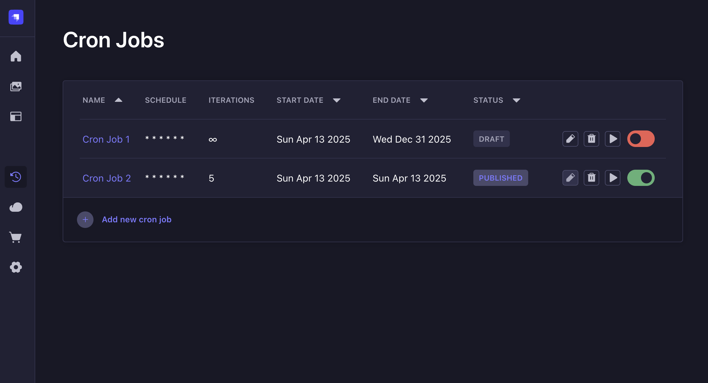

# Cron plugin for Strapi

**Manage and monitor cron jobs from Strapi admin panel.**
<br />
<br />



## 👋 Get Started

- [Features](#-features)
- [Installation](#-installation)
- [Usage](#-usage)
- [Development](#-development)

## ✨ Features

- GUI integrated with Strapi admin panel
- tasks scheduling tool incorporating start/end dates and iterations counter
- script logs & monitoring

## 📦 Installation

1. Run the following command from the Strapi app root directory.

```
[npm|yarn|bun] add @innovato/strapi-plugin-cron
```

2. Update or create `./config/plugins.ts` file with the following config:

```JS
export default () => ({
  'strapi-plugin-cron': {
    enabled: true,
    resolve: './src/plugins/strapi-plugin-cron',
  },
})
```

3. Run the build command from the Strapi app root directory.

```
[npm|yarn|bun] run build
```

## 📌 Usage

If you want to maintain your cron job script files within the parent project and track them with a VCS, you should place them in a location relative to `<your-strapi-project>/src/extensions/strapi-plugin-cron/`.

The script file should be a `.js` module which exports an async function:

```JS
module.exports = async ({ strapi, cronJob }) => {
};
```

The function has access to `strapi` global variable and the relevant `cronJob` object.

The script snippet maintained via the Cron plugin dashboard has a direct top-level access to those parameters.

## 🔧 Development

A supplementary repository for development is available here [@mjnoach/strapi--strapi-plugin-cron](https://github.com/mjnoach/strapi--strapi-plugin-cron)
